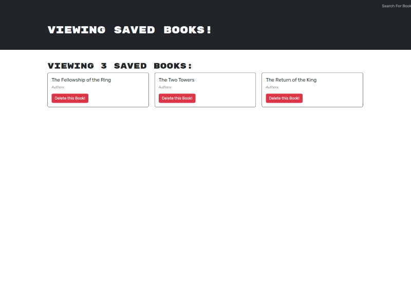

# book-search-engine

## Description

This is a project for UW Bootcamp in which we were asked to take a functioning book search engine built with a RESTful API and refactor it to be a GraphQL API built with Apollo Server.  This app is built with a MERN stack, with a React front end, MondoDB and Node.js/Express.js.

## Installation

No installation needed.

## Usage

This app is set up for the user to be able to sign up/log in, search books, and keep a list of their books saved to the back end. 

Link to deployed application: https://kent-tuneberg-coding.netlify.app/

Search Page

User Book List

## Credits

N/A

## License

N/A

## Questions

Any questions about this application should be directed to:

GitHub: https://github.com/ktunebe

Email: ktunebe@gmail.com